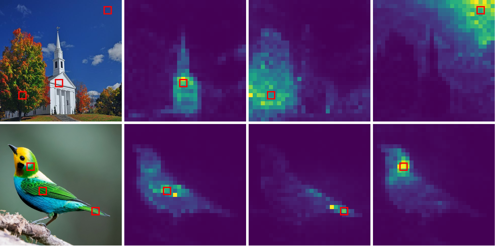

# SemanticMIM
Implementation of paper: "SemanticMIM: Marring Masked Image Modeling with Semantics Compression for General Visual Representation".

## Attention Visualization
<div>
  
</div>

The self-attention map of our pre-trained ViT-B. The first column is the input images, where query patches are marked with red bboxes. The other columns are the response attention map of the corresponding quries without any post-processing.
Please check the paper for more examples.

## Setup
The implementation is based on [MMPreTrain](https://github.com/open-mmlab/mmpretrain) framework. Please follow the instruction [here](https://github.com/open-mmlab/mmpretrain) to build the environment.

If you want to evaluate the pre-trained model on ADE20K, [MMSegmentation](https://github.com/open-mmlab/mmsegmentation) is needed and the installation guide is [here](https://github.com/open-mmlab/mmsegmentation/blob/main/docs/en/get_started.md#installation).

## Pre-training
Our method could be applied on any Masked Image Modeling framework. In this repo, we provide support for BEiT (paper link) and MaskFeat (paper link) as the baselines. 

For example, training a vanilla BEiT with single GPU:
```bash
python train.py configs/beit/beit_baseline_pretrain.py
```

Training SemanticMIM based on BEiT with 8 GPUs:
```bash
bash dist_train.sh configs/beit/beit_bottleneck_pretrain.py 8
```

Configs of training MaskFeat are in `configs/maskfeat/` with similar naming rules.

All configs in this repo are set by default for 8 GPUs training.

## Fine-tuning and Linear Probing on ImageNet-1K
Check `configs/xx/xx_cls_ft.py` and `configs/xx/xx_cls_linear_probing.py` for fine-tuning and linear probing configs, respectively. Use them like when pre-training.

## Fine-tuning on ADE20K
Please confirm that MMSegmentation has been installed correctly.

For single GPU:
```bash
python train_seg.py configs_seg/beit/beit-base_upernet_8xb2-160k_ade20k-640x640.py
```

For multiple GPUs:
```bash
bash dist_train_seg.sh configs_seg/beit/beit-base_upernet_8xb2-160k_ade20k-640x640.py 8
```

## Linear Probing on PascalVOC
Following settings of Leopart (repo link), we build a 1x1 conv layer on top of the frozen feature for semantic segmentation. Please prepare the dataset following the Leopart repo.

Command Format:
```bash
python -m torch.distributed.launch --nproc_per_node=8 eval_segment.py --pretrained_weights /path/to/ckpt --output_dir /path/to/log_dir/
```